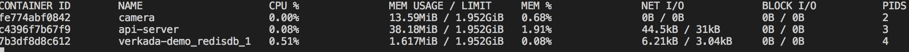

# http-long-polling

## Explination

**tl;dr: Enables servers to push information to http clients.**


I highly recommend reading [this article](https://www.pubnub.com/blog/2014-12-01-http-long-polling/) for more information on long polling. An exerpt:
>To overcome this deficiency, Web app developers can implement a technique called HTTP long polling, where the client polls the server requesting new information.  The server holds the request open until new data is available. Once available, the server responds and sends the new information. When the client receives the new information, it immediately sends another request, and the operation is repeated. This effectively emulates a server push feature.

In our mock setup here we have an IoT device (a camera) that generates a data point every 10 seconds. It sends out a request to the api server, which is then intentionally suspended. At this point the logic is as follows.

- A user requests the camera logs from the api server.  
    - The api server will suspend the user request.
    - The api server will return a http 200 to the camera.
    - The camera will push its log data to the api server via a seperate endpoint.
    - The api server completes the user request with the newly aquired camera logs.
    - The camera sends a new request to be suspended.
- No user requests come in before the timeout window expires.
    - The camera simply sends another request to be suspended by the api server.

## Performance

The elephant in the room when it comes to long polling is the delay on user responses due to the server waiting on updates to be sent out. This design partern accepts the response time penalty inherited by network variability, payload transfer rates, and thread syncronization time.

With this in mind we can optimize what we control, the thread synchronization. It should be immediatly obvious that async request processing will be mandatory as to not I/O bind our api server. Gunicorn fulfills our needs of async processing through gevent and flask support. [Here is more info on gunicorn worker types.](https://www.spirulasystems.com/blog/2015/01/20/gunicorn-worker-types/) 

With the ability for async processsing, we still have to define a thread communication system that will scale as our service scales. We can now instantiate our own thread events to coordinate our api server in a performant, and thread safe way. This lets us avoid sleeping threads and wasting CPU cycles on what is called '[busy waiting](https://en.wikipedia.org/wiki/Busy_waiting).'

I quickly compared CPU usage between 'busy waiting' and utilizting python's 'thread events.'

Busy Waiting:


Thread Events:



You can see that our thread events utilize only 1/10 the CPU resources that our busy waiting method does. It also allows for more graceful http timeouts between the camera and api server.

## To run

```bash
docker-compose build
docker-compose up
```

This will kick off three containers

- api server
- camera
- redis

## To query

### Postman

I have included a basic postman collection for simple queries under /postman.

[Directions to import postman collections.](https://learning.getpostman.com/docs/postman/collections/data_formats/#importing-postman-data)

### Curl

```bash
curl --user USER:PASS localhost:5000/logs/
```
